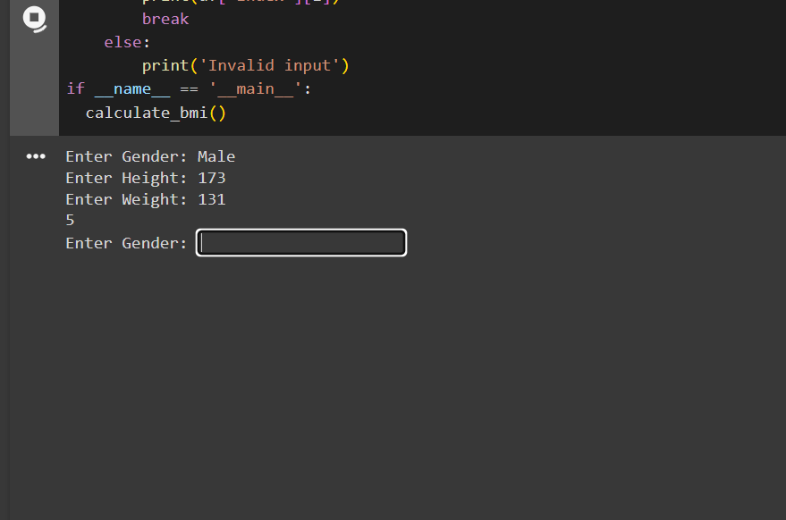

# BMI-tracker-App
# CODTECH-INTERSHIP
NAME: SOAN DIAZ  E S  
COMPANY: CODTECH IT SOLUTIONS PVT.LTD  
ID: CT6WDS1254  
DOMAIN: MACHINE LEARNING  
DURATION: 6 WEEKS from JULY 10th, 2024 to AUGUST 25th, 2024.  
MENTOR: NEELA SANTHOSH KUMAR  

## Overview of project  
BMI Tracker App  

### Objective  
Develop an app that calculates Body Mass Index (BMI) based on user
input for height and weight.  
### Key Activities  
Preprocess text data  
Train  
Testing  
### Technologies Used  
Python: The programming language used.  
pandas: Used loading the csv file and data manipulation.  

